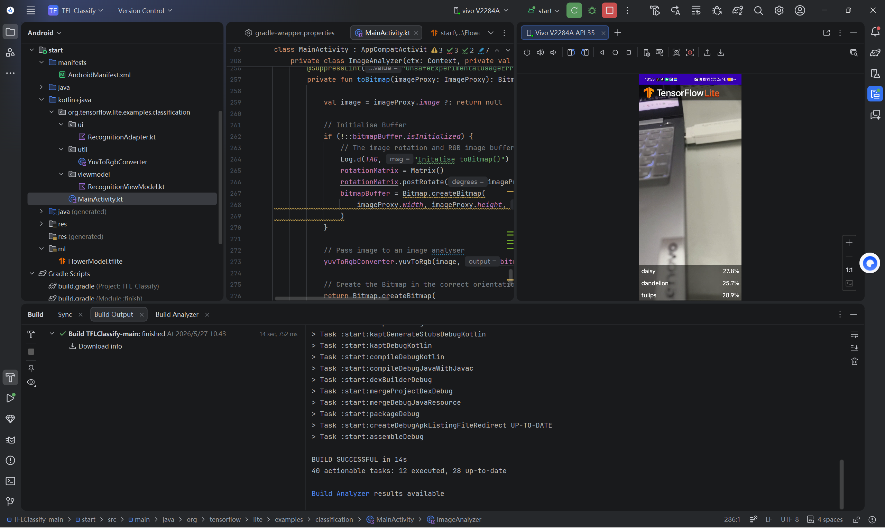

# Android 智能花卉识别应用（基于 TensorFlow Lite + CameraX）

## 项目简介
本项目是 **Android 端实时图像分类 APP**，基于 TensorFlow Lite 实现离线花卉识别。
使用训练好的图像分类模型 `FlowerModel.tflite`，结合 CameraX 相机库，实现：
- 实时摄像头预览
- 实时图像识别
- 展示置信度最高的 3 个分类结果
- 完全离线运行，无需网络

## 实现功能
✅ 完成 TensorFlow Lite 模型导入  
✅ 完成相机权限申请与 CameraX 预览  
✅ 完成图像格式转换（ImageProxy → Bitmap → TensorImage）  
✅ 完成模型推理、结果排序、UI 展示  
✅ 移除假数据，使用真实模型识别结果  
✅ 真机运行成功，实时识别花卉类别  
✅ 支持 5 种花卉分类：雏菊、蒲公英、玫瑰、向日葵、郁金香  

---

##  开发环境
- Android Studio Hedgehog 2023.1.1
- Kotlin
- Gradle 7.5
- Android 手机（开启USB调试）
- TensorFlow Lite 模型绑定（ML Model Binding）
- CameraX 1.3.0

---

## 项目结构
TFLClassify/
├── finish/        完整参考模块
└── start/         实验完成模块（本次实验核心）
    └── src/main/
        ├── java/.../MainActivity.kt   # 主活动，完成所有TODO
        ├── ml/FlowerModel.tflite      # TFLite 花卉模型
        ├── res/layout/activity_main.xml  # UI 布局
        └── AndroidManifest.xml        # 权限配置

---

## 运行步骤
### 1. 克隆/下载项目
git clone https://github.com/你的用户名/TFLClassify.git

### 2. 使用 Android Studio 打开
选择 `Open Project` → 选择项目根目录  
等待 Gradle 同步完成。

### 3. 导入模型（已完成）
1. 右键 `start` 模块
2. New → Other → TensorFlow Lite Model
3. 选择 `finish/ml/FlowerModel.tflite`
4. 自动添加依赖并生成模型类

### 4. 连接手机并运行
1. 手机开启 **开发者选项 + USB调试**
2. 点击 Android Studio 运行按钮
3. 选择你的手机
4. 安装并启动 APP
5. 授予相机权限
6. 对准花卉即可看到识别结果

---

##  核心代码实现
### 1. 初始化模型（TODO 1）
private val flowerModel = FlowerModel.newInstance(ctx)

### 2. 图像转换（TODO 2）
val bitmap = toBitmap(imageProxy)
val tfImage = TensorImage.fromBitmap(bitmap)

### 3. 模型推理与排序（TODO 3）
val outputs = flowerModel.process(tfImage)
    .probabilityAsCategoryList.apply {
        sortByDescending { it.score }
    }.take(MAX_RESULT_DISPLAY)

### 4. 封装识别结果（TODO 4）
for (output in outputs) {
    items.add(Recognition(output.label, output.score))
}

### 5. 注释假数据
// for (i in 0 until MAX_RESULT_DISPLAY){
//     items.add(Recognition("Fake label $i", Random.nextFloat()))
// }

---

## 运行效果
- 相机实时预览
- 底部列表显示 Top3 识别结果
- 显示类别名称 + 置信度

---

## 实验总结
本实验成功完成：
1. 掌握 TensorFlow Lite 模型在 Android 中的导入方法
2. 掌握 CameraX 相机实时分析流程
3. 掌握图像格式转换、模型推理、结果处理
4. 实现真实的离线花卉识别 APP
5. 学会使用 ML Model Binding 自动加载模型
6. 完成真机测试，功能稳定运行

---

## 参考文献
- Google 官方 TensorFlow Lite 文档
- Android CameraX 开发文档
- Recognize Flowers with TensorFlow Lite on Android

